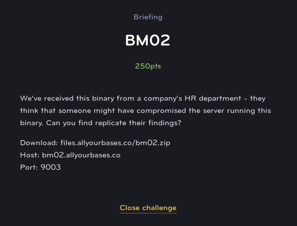
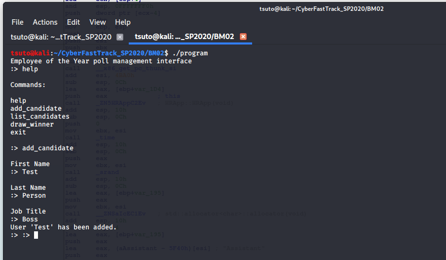
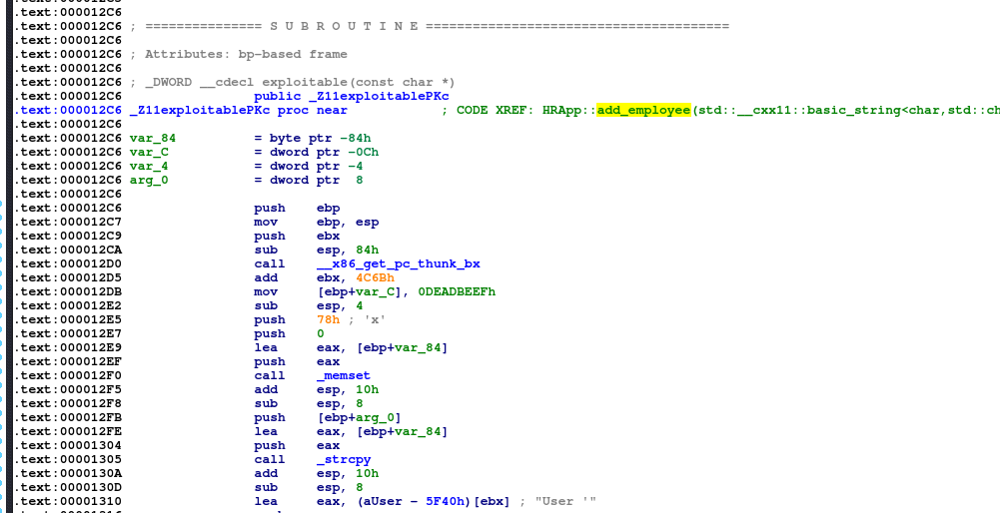
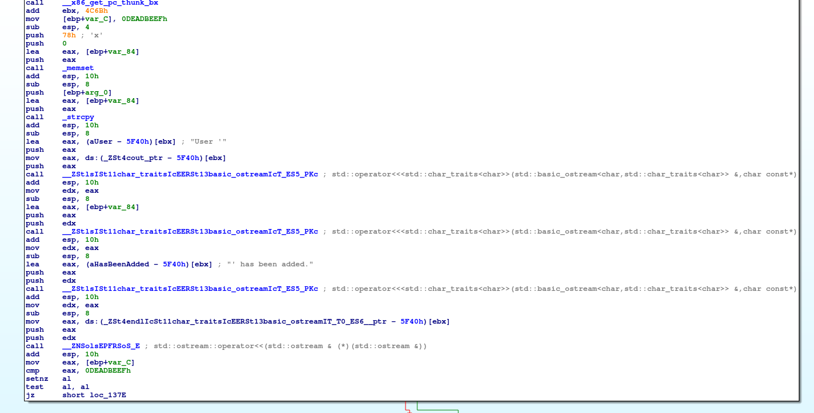
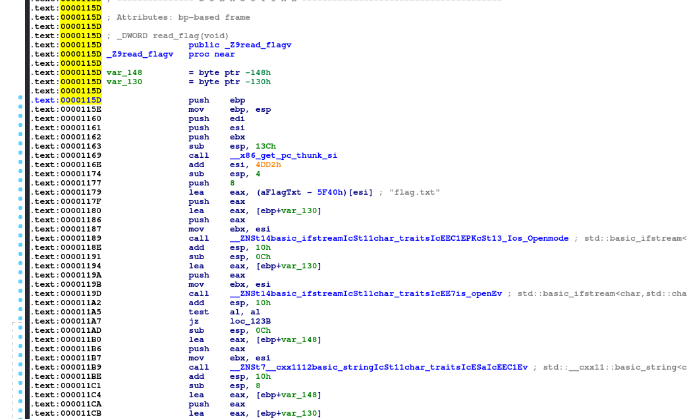
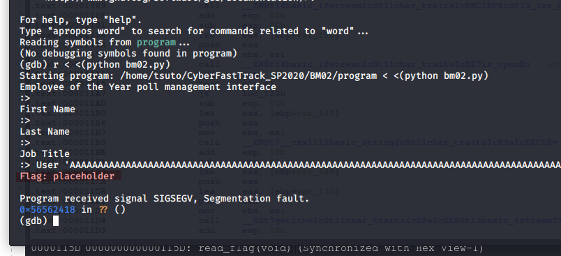

# BM02
## Binary Exploit (Medium)



BM02 is the first of a series of challenges where we are required to use buffer overflow exploits to try to gain access to the flag. We are allowed to craft our exploit using the provided executable and then send the exploit to a remote server where hopefully it will have the correct effect and print the flag.

In this case, we are given an HR app for choosing an Employee of The Month winner from a random selection of candidates.



Opening the program in IDA, the first thing that caught my eye was the **exploitable()** function (thanks CTF creators)


Next we need to see where this function is called, using the XREFs in IDA, we can see that is is called in the **add_employee()** function after a new candidate for EoTM is added. So this will be the point where we can introduce our payload into the program.



If we look at the exploitable function itself, we can see that it allocated 120 bytes of memory and then uses the unsafe strcopy() function to copy the first name of the employee into that buffer. This means that if we pass an input of 120 characters and then our payload, we can overwrite the return address and redirect the program into the **read_flag()** function that we see in the functions list as well.

The other important detail is that we can see at the bottom of this function, the creators have added a sort of naive stack canary. It compares a section of memory right at the top of the stack with 0xDEADBEEF and, if the value does not match, then it exits the program. Otherwise, it continues.

This is somewhat inconsequential, because we can simply include that value in our payload and make sure that it lines up with the proper spot and also passes the correct address for the function we want to return to after the function finishes.



Looking at the **read_flag()** function, we can see the address is 0x5655615d so we can use this to begin to craft our payload



In order to automate everything, it is easiest to use python and pass the correct payload, which we can then pipe into the local program for testing, or netcat to do the real thing on the remote server.

The code below prints out the add_candidate command, then the payload itself for the first name, and then the last name and position, before exiting.

The payload contains a large number of A's, followed by the stack canary value, a few more bytes of padding, and then the desired return address to the flag function. Note that any addresses passed this way are done so in reverse byte order.

```python

print("add_candidate")
print("A"*120+'\xef\xbe\xad\xde\x41\x41\x41\x41'+'B'*8+'\x5d\x61\x55\x56')
print("Test")
print("Boss")
print("exit")

```

Testing with GDB, we can use the following command to input the python output into the program while debugging

```
r < <(python bm02.py)
```

We can see that it correctly exploits the local binary and causes it to return into the **read_flag()** function, where it prints out the flag.



In order to obtain the real flag from the remote server (sorry I didn't take a screenshot again), we can pipe it into netcat instead:

```
python bm02.py | nc bm02.allyourbases.co 9003
```

This sends the payload to the server, where it prints out the real flag for you to enter.
