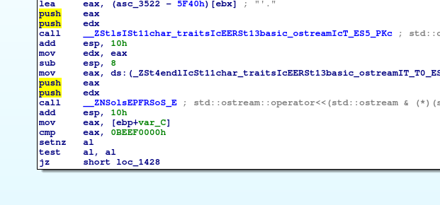
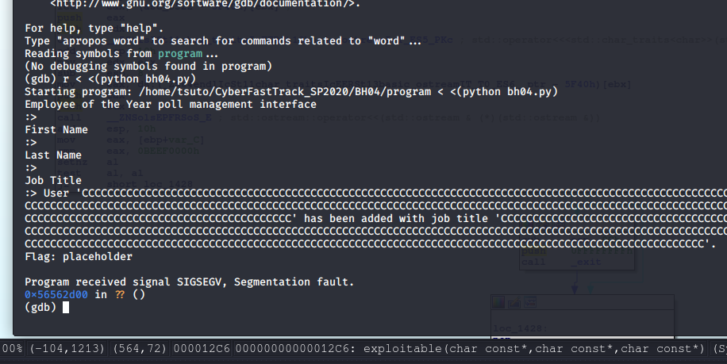

# BH04
## Binary Exploit (Hard)


This challenge uses a similar executable to BM02 where we are dealing with an HR app that is used to randomly select an Employee of The Month from the available candidates. However this one has a few modifications that make it a little tricker to exploit.

If you want to see the more basic exploit, take a look at the [BM02 Solution](/BM02).

Just as before, this one includes an **exploitable()** function that accepts information about the employee after the function is called to add a new employee as a candidate for the award. However, you'll notice that this one accepts all three inputs and sets them in memory instead of just the first name.


The other thing that is important is that the stack canary value which was **0xDEADBEEF** in BH02 has been changed to **0xBEEF0000** for this challenge.

While this may not seem like much, it presents a serious problem when building our payload because C-style strings are null terminated. This means that any payload including the 0x00 byte, will be truncated when it is being read by the program because it believes it has reached the end of the string.



This is where it becomes important that we are able to enter all 3 strings into the function because we can do this exploit in a multi-stage way where we can overwrite the return address as we did in RM02, and still be able to set the correct canary value.


```python
print("add_candidate")
print("A"*122+'\xef\xbe\x41\x41\x41\x41'+'B'*8+'\x5d\x61\x55\x56')
print("B"*241+'\x00')
print("C"*360+'\x00')
print("exit")
```

Breaking down the payload above, we repeat the same buffer overflow as BM02, except we only write the 0xBEEF bytes and the return address. 

Next we fill in the last name field (which is the 120 bytes above the first name buffer) so it overwrites the first name buffer as well and then ends with 0x00 byte. This adds the first null byte to the canary value.

Then finally we fill in the title field, which also overwrites the first and last name, and then the final 0x00 byte. 

So the end result is that we are able to overwrite the return address and then construct the canary value by piecing together the three different payloads.

Running the payload while debugging with GDB, we see the correct redirect to the **read_flag()** function.



Running the same python script and piping the output into netcat, we are able to obtain the real flag:

```
python bh04.py | nc bh04.allyourbases.co 9002
```
